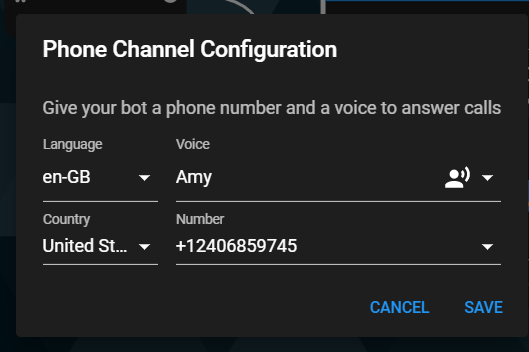

# How to connect your chatbot to a phone number

You were sent to create an awesome chatbot. You did it. You answered the call! Now all is left is to create it to a phone number, so your chatbot can answer the call.

On the right top corner, under channels, you will find a “phone” option. Click on it.

The following screen will be opened:

-   Choose the language you need
-   Choose the voice you want (male/female)
-   Choose the country you want to have your phone number at, out of dozens of options
-   Choose a phone number out of the variety you’ll have
-   **Click “Save”.**

Hurray! Your chatbot is connected to a phone. You can call it and speak to it.

It was THAT simple, we know. Now go bring yourself something to drink. You earned it.
