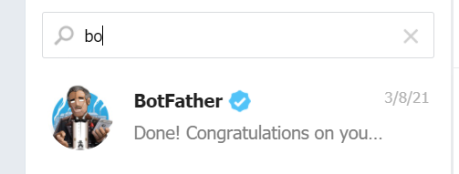

# How to publish your chatbot on Telegram

So, your chatbot’s conversational flow is ready! You rock! Now let’s go and publish it on one of the world’s most popular messaging platforms: Telegram.

First, go to the channels on the right top corner, then choose... Telegram! (That part is simple, we know).

But now there’s a pop-up that asks you for a TOKEN, threatening to throw your whole existence into a downward spiral. That’s what you need to do now:

One row above, there’s a sentence:

## Not sure how to create a bot on Telegram? Click Here

But we’re here to explain, right? So,

-   Go to your Telegram app (Desktop or Mobile, doesn’t matter)’s search window
-   Search for the BotFather - it’s an offer you can’t refuse (Literally. That’s the only way to publish your chatbot there)

-   In the chat with botfather, write **/newbot**
-   The botfather will answer: _Alright, a new bot. How are we going to call it? Please choose a name for your bot_.
-   Give a name for your chatbot. For example, “Wizard of oz”
-   The botfather will answer: _Good. Now let's choose a username for your bot. It must end in `bot`. Like this, for example: TetrisBot or tetris_bot._
-   Give a username for your chatbot, that ends with “bot”. For example, “wizardofozzzzbot”
-   The botfather will congratulate you and give you two important things: the link to start chatting with your bot (in blue) and the link to the token (in red). Imagine that you’re a raging bull and look for the red token. Copy it
-   Go back to CoCoHub and paste the token, then click “Save”
-   Wait 3 seconds, and watch the lower left corner, until you have a “Channel Created” green notification popping up, followed by a pop-up announcing that your Telegram bot is alive.
-   Go back to your telegram, and click on the link provided by the botfather
-   Talk to your chatbot on Telegram like there’s no tomorrow!

If you’re updating your chatbot, you don’t need to go through all of it again - just finish updating, and click “update”.
