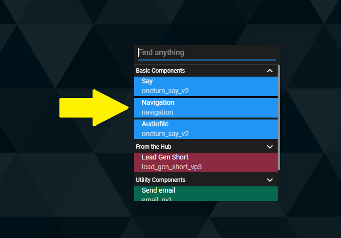
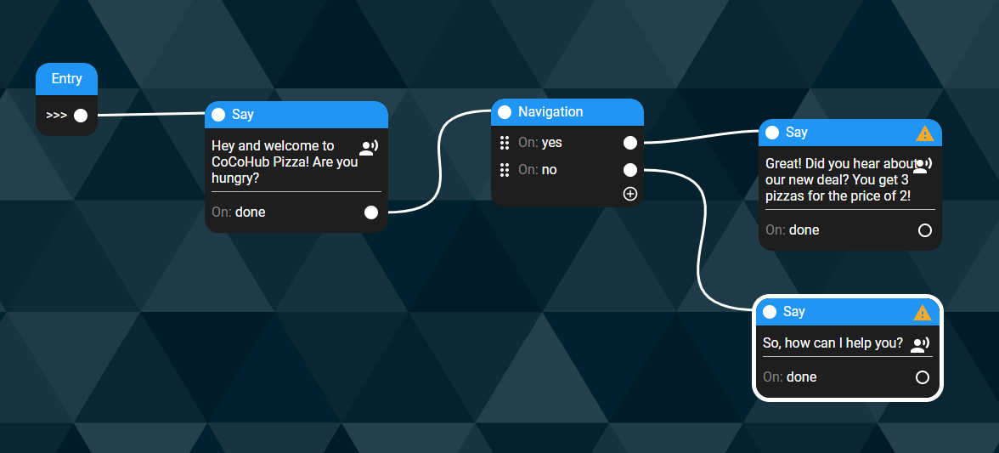
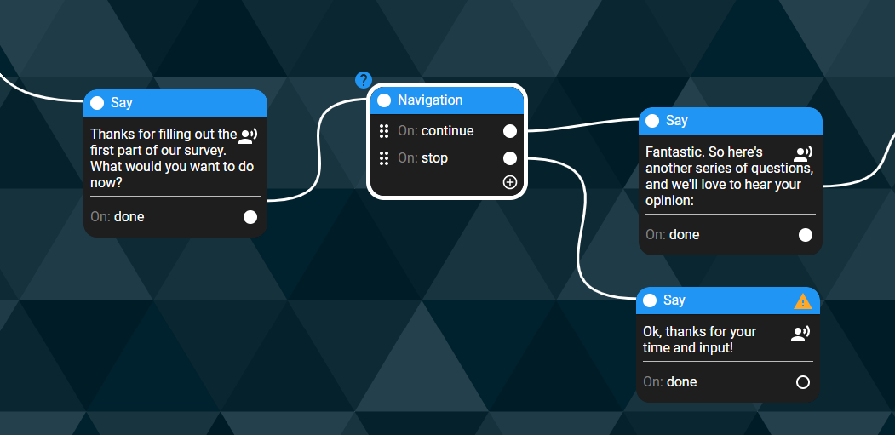
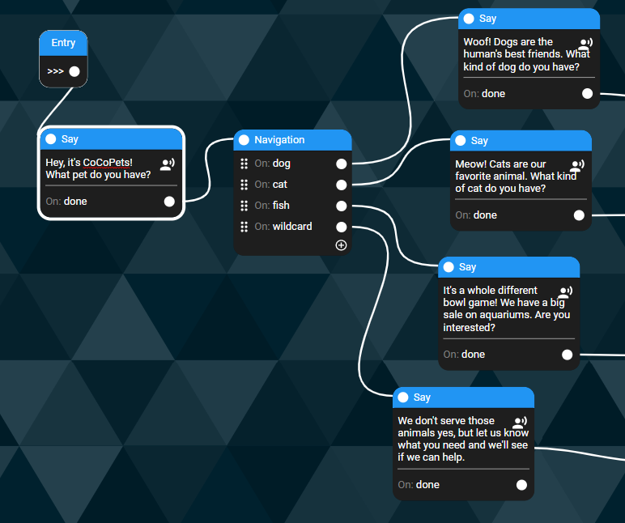
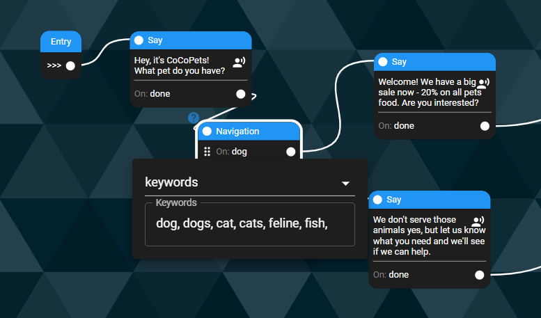

# How to use “navigation” based on user’s input

So, after nailing the part where the chatbot speaks - the “Say” - now we go to the **Navigation **- the part in the conversation when the user speaks.

Our role, as conversation designers, is to smoothly lead the user into saying what we planned (Happy Path). Generally, as in life in general, we need to be prepared for anything.

## 1. Left-click on the canvas and click on the navigation node

Navigation nodes can be operated in two ways: Intents and Keywords.

## 2. 1. Intents

So, intents are collections of semantically similar utterances that basically mean the same thing in a conversation. For example, “Yes” is a word, but “Yeah!”, “Sure”, “YESSS” and “Yup” also mean the same thing, and we should embrace them as well.

On CoCoHub’s studio, we have 5 intents - click on the needed one

Yes - the user answers in a positive way

No - the user answers in a negative way

Continue - the user asks the chatbot to go on

Stop - the user asks the chatbot to abort the conversation

Wildcard - an option in which every input by the user is valid, and yields the same response. What is it good for? Here are two examples:

-   When you need the user’s opinion or answer for data-collection purposes - and the scope of answers is too wide (“What’s your favourite travel destination in the world?”)

-   When you don’t really need the user’s data at that point - but you want to make the user feel involved and engaged (“How was your day?”)

## 2. 2. Keywords

Keywords are the way to go when you expect the user to answer with a specific word, sentence or phrase; if the user won’t respond with these words, the conversation can be unfruitful.

For example, if you have a pet shop and you serve only people with dogs, cats and fish (which covers almost 99% of the pets owned in the USA), your chatbot can relate only to those people and filter out all the rest.

With keyword, you can design a different flow for every keyword or phrase

Or put all of them in the same keywords space, if you want to have the same flow from there onwards for all those keywords.

### CoCo Tip

If you’re choosing keywords, make sure you put all the relevant words and synonyms there, so you won’t miss anything that can fit - for example, if you write “cat” as an option, make sure you have “cats” and “feline” there too.
