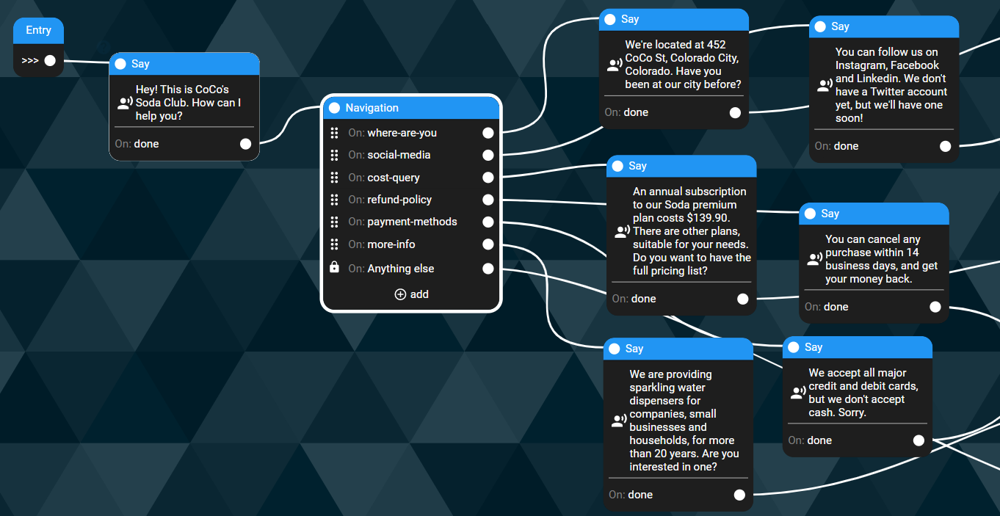
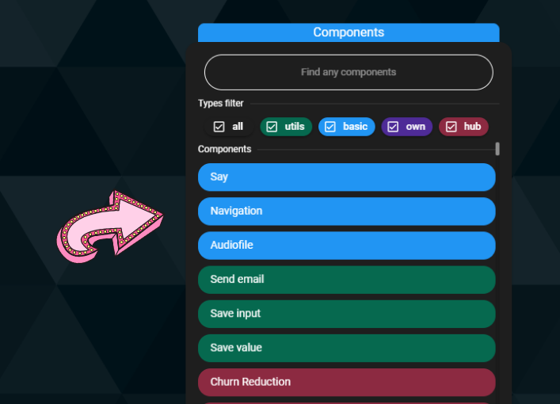
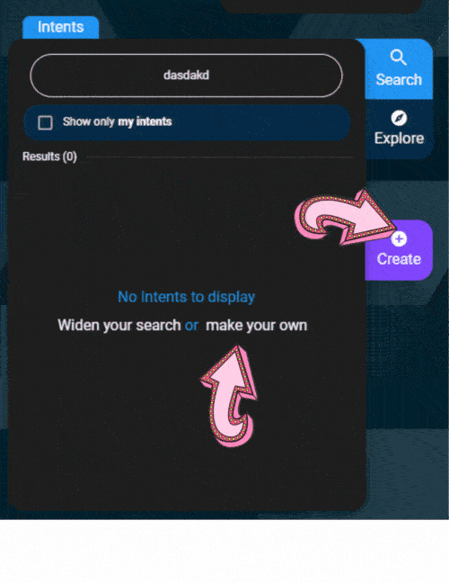
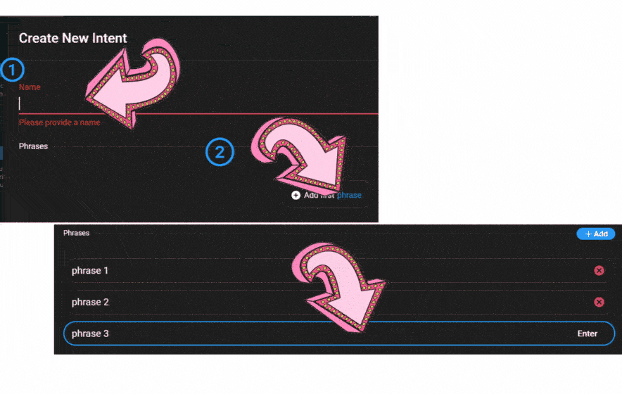
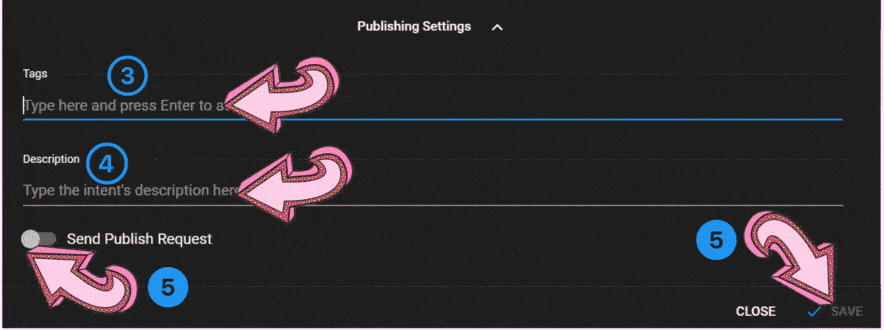
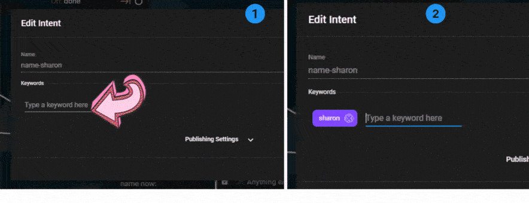

# How to use “navigation” based on user’s input

So, after nailing the part where the chatbot speaks - the “Say” - now we go to the **Navigation **- the part in the conversation when the user speaks.

Our role, as conversation designers, is to smoothly lead the user into saying what we planned (Happy Path). Generally, as in life in general, we need to be prepared for anything.

## 1. Left-click on the canvas and click on the navigation node

So, intents are collections of semantically similar utterances that basically mean the same thing in a conversation. For example, “Yes” is a word, but “Yeah!”, “Sure”, “YESSS” and “Yup” also mean the same thing, and we should embrace them as well.

On CoCoHub’s studio, we have plethora of intents - in which you only need to write the answers: Conversation basics (Hi, Bye, Yes, No...), Customer Service musts (Opening hours, prices, locations...), Emotions, Small talk, etc.

## 2. Click “Add an intent” and a menu will pop up. 

- Type your desired intent in the search window, or
- Scroll down and up, up and down, until you find something fitting. 

Once you hover with the mouse over the intent, you’ll see what it does and some examples of relevant inputs. 

Now, by clicking on the eye button, you can get inside and see the complete variety of phrases and utterances.

To create your own intent, click the “Make your own” link or the “Create” button - and an intent creation menu will appear. 

nav_create_learned1.gif

Now you have two kinds of intents: Learned (ML-based) and Keywords.

## 2. 1. Learned Intents

- Give the intent a name, that reflects the intent’s purpose or essence.

- Click “Add first phrase”, then add relevant phrases. Press “Enter” to move to a new phrase. You can always delete existing phrases. You don't have to list every possible way of saying what you want - it's ML-based after all.

- Open “Publishing settings”, and add some relevant tags (such as “customer service”, “small talk”, “name”, etc) that will help in finding your chatbots' intents

- Add a description - a short explanation on the intent’s purpose (“User tries to…”)

- If the intent is specific for your purpose, business or use case, just click “save” and it’s saved. If you think it’s useful enough for all our community, click on “publish request” and we’ll review it - if it’s good enough, you’ll have your own intent in the hub.

## 2. 2. Keyword Intents

If you want to provide specific answers to specific keywords - just choose the keyword intent.

- Give the intent a name, that reflects the intent’s purpose or essence.

- Enter all relevant keywords that will be answered identically 

- Go to “Publishing settings” - add tags that will help you in finding your chatbots' keywords

- Add a description - a short explanation on the intent’s purpose (“User talks about…”)

- Click "Save"

After finishing, don't forget to match specific answers to those keywords

## 2. 3. "Anything Else"

Anything else: Every option that the users says outside the scope of conversation you designed. It can also be useful...

-   When you need the user’s opinion or answer for data-collection purposes - and the scope of answers is too wide (“What’s your favourite travel destination in the world?”)

-   When you don’t really need the user’s data at that point - but you want to make the user feel involved and engaged (“How was your day?”)

### CoCo Tip

If you’re choosing keywords, make sure you put all the relevant words, synonyms and even popular typos there, so you won’t miss anything that can fit - for example, if you write “cat” as an option, make sure you have “cats” and “feline” there too.
