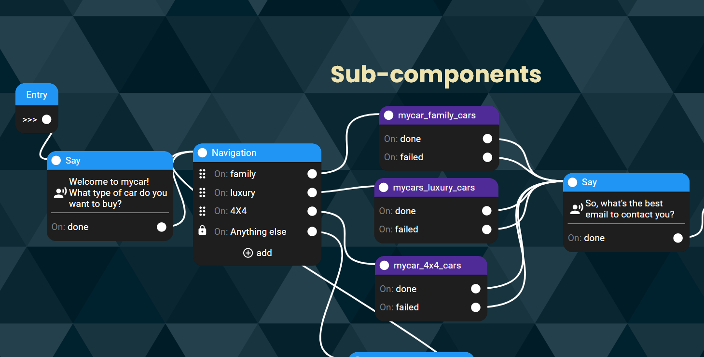

# How to use your own components in a chatbot

You know those dolls, in which you open a doll to find another one inside, then a smaller one, then a smaller one? So this is another way to look at building a chatbot: you can build sub-components, then use them over and over in a bigger chatbot.

Let’s say you’re having a car company and you want to build a flow for family cars, one for luxury cars and one for 4X4 cars. Do you need to create 3 different chatbots? Not really. Just build a flow called “family cars”, a second one called “luxury cars”, and a third one called “4X4 cars”. Those will be your sub-components. They, and every other component you’ll use in a chatbot, will be colored in purple.

When writing the full chatbot, start your conversational flow by asking the person what is the type of car they’re looking for - then, just direct them to the different flows. After they finish the relevant flow, you can continue from all different flows together to set an appointment with your sales team to close the deal!

Every chatbot you build is a component that can be a sub-component of another chatbot. For example, let’s say that you’re very rich and you run multiple car rental companies - “mycar”, “yourcar” and “ourcar”. So in the beginning, you can ask the customer to choose between those 3 car rental companies - and if the customer wants “mycar”, this whole chatbot you’ve just created is a sub-component of the big chatbot.
