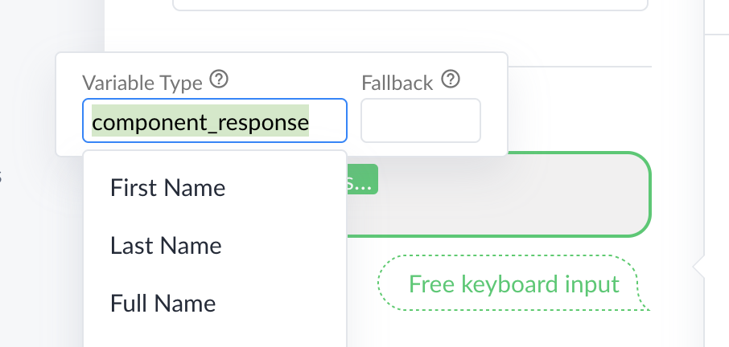

# Use CoCo Component As ManyChat Dev-Tool

At the following tutorial we'll create a flow for [ManyChat](https://manychat.com/) that will implement 
[CoCo Namer component](https://cocohub.ai/blueprint/namer_vp3/about) in it.

Link to the final flow: [namer_flow](https://manychat.com/flowPlayerPage?share_hash=1819595611640973_f35ecc00c2b7f5a2836c600c711be115a974a0d5)


## Create New Flow

* Choose **Flows** at the menu.

* Press On create flow at the right top corner.

## Create Action With External Request

### Create HTTP Request Action

* Create Action:


* Choose HTTP Request Action:


### Configure Action
#### Request Link

https://cocohub.ai/api/exchange/ [ CoCo Component ID ] / [ User ID ]

 * Choose Component from [CoCoHub](https://cocohub.ai).
 * User ManyChat variable user_id.
 
#### Request Body
Use ManyChat **Last Text Input** variable

```buildoutcfg
{"user_input": [ Last Text Input ]}
```

##### Parse Response

Parse component response, extract the following variables:

* **component_done** - Boolean - True/False depends on if component complete it's goal.
* **component_response** - Text - Bot response.


## Send Component Response And Wait For User Replay.

* Create new node called **Send Message**.


* Choose user input feature at the node:


* Place component response variable as a bot message:



## Set Condition

Set condition to check if the component done with it's purpose. If not
redirect back to the HTTP request action.

* Create Condition:


* Set condition for component_done variable is false:


## Publish & Test 

* Publish:


* Test:


