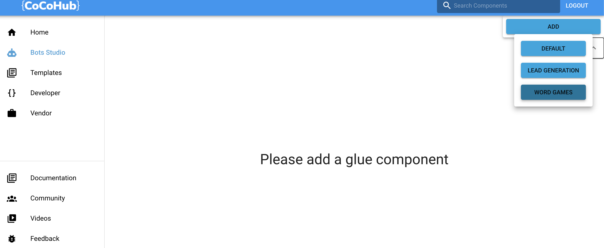
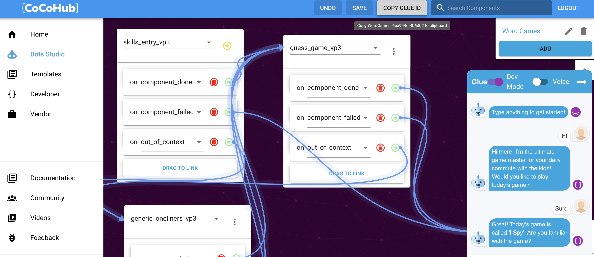
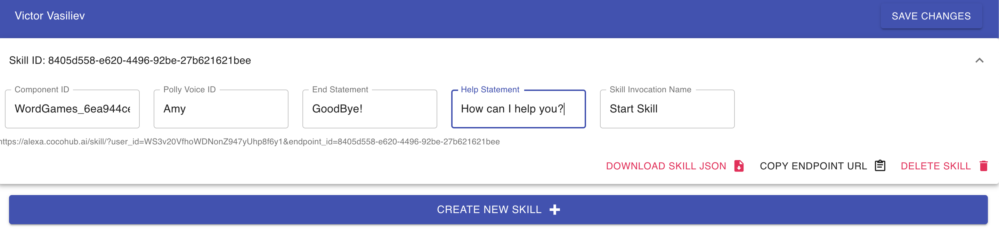

### Steps:

* Choose one or more relevant components, using Cocohub's Bot Studio editor.
* Create a new Alexa Skill on CoCoHub's Alexa Skill Service.
* Configure your Alexa Skill.

## Get A Component

As an example we'll create a Alexa Word Game Skill:

* Go to [CoCoHub](https://cocohub.ai/ "CoCoHub"), sign Up and click Bot Studio on the left sidebar.
* Create a new component from the "Word Games" Template.

* Copy the component ID.

## Create Alexa Skill On Alexa Skill Service
* Go to [CoCoHub's Alexa Skill Service](https://alexa.cocohub.ai "CoCoHub's Alexa Skill Service").
* Login and create a new skill.
* Fill in the following fields:
    * **Component ID**: The bot component ID, from the step above.
    * **Polly Voice ID**: The voice which the skill will use. Here are the available voices: [Available Voices](https://docs.aws.amazon.com/polly/latest/dg/voicelist.html "Available Voices").
    * **End Statement**: Skill response when users wishes to end the skill.
    * **Help Statement**: Skill response will be returned on AMAZON. Help intent.
    * **Skill Invocation Name**: The phrase which will invoke the skill. Eg. Alexa, open Jeopardy

## Configure Your Alexa Skill
* Place the generated endpoint url at the endpoint section.

* Upload the Skill JSON Editor.(Intents -> JSON Editor)

