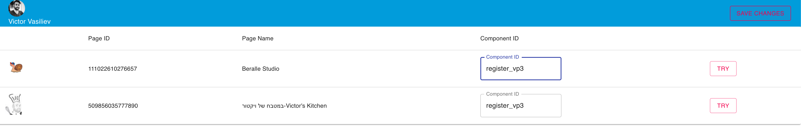
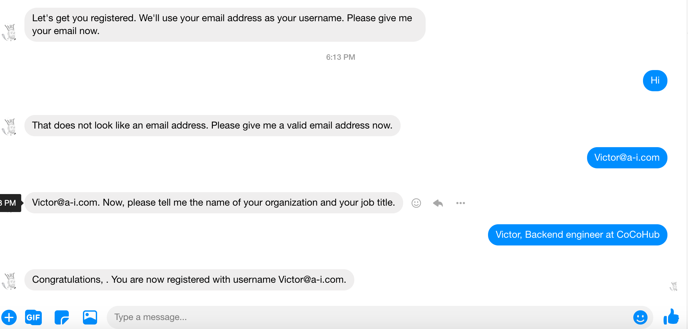

# Deploy a Component To Facebook Via CoCoHub Facebook Channel.

### Requirements
* A Facebook Page

### Deployment

* Go to CoCohub's Facebook Channel.
* Login with Facebook.
* Select the page(s) that you would like to connect to a component.

* Paste the component ID in the Component ID field of the target page.

* Save the changes.
*  Give it a try!

