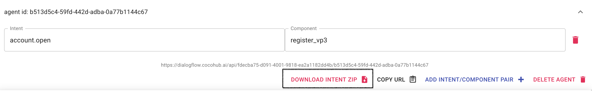

# Map DialogFlow Intent To Component

In the following tutorial we'll add a component into [Dialogflow](https://dialogflow.cloud.google.com/ "Dialogflow"). 

The component will be triggered when a relevant intent matches.
More specifically, we'll use the [register component](https://cocohub.ai/blueprint/register_vp3/about "register component")
from the [Hub](https://cocohub.ai/ "CoCo Marketplace").

Here's what the end result looks like:
<iframe width="560" height="315" src="https://www.youtube.com/embed/9iGWVK7CcjQ" frameborder="0" allowfullscreen></iframe>

#### Steps:

* Choose one or more relevant components using CoCoHub's Bot Studio editor.
* Create a new agent on CoCoHub's Dialogflow Service.
* Import CoCo intent from dedicated ZIP (Available on agent tag from the step above).
* Enable webhook in the Fulfillment section and set the url to be the endpoint from the steps above.
* Enable webhook call on the target intent.

## Get a component.

* Go to [CoCoHub](https://cocohub.ai/ "CoCoHub"), sign Up.
* We'll use the register component [register component](https://cocohub.ai/blueprint/register_vp3/about "register component")

## Create Dialogflow Agent On CoCoHub's Dialogflow Service

* Press the "Add An Agent" button.
* Press the "Add Intent/Component Pair" to map the intent name to the component ID.

## Import ZIP CoCo Intent To Your Agent

* Download the intent ZIP file from the dialogflow service.

* Go to Agent settings.
* Go to "Export And Import".
* Press Import and choose the downloaded ZIP file.

## Enable webhook in the Fulfillment Section

* Go to the Fulfillment section.                 
* Press on enable webhook.

* Set the url to be the endpoint from the dialogflow CoCoHub's service.

## Enable webhook call On The Target Intent.

* Go to the target intent.
* Scroll to the bottom and press the enable webhook call.

