# Plug a CoCo Component inside Dialogflow Conversation Flow.

In the following tutorial we'll implement a [CoCo](http://conversationalcomponents.com/ "CoCo")
component into our [Dialogflow](https://dialogflow.cloud.google.com/ "Dialogflow")
conversation flow. A component will be triggered when a relevant intent matches.
More specifically, we'll use the [CoCo](http://conversationalcomponents.com/ "CoCo") [register component](https://marketplace.conversationalcomponents.com/blueprint/register_vp3 "register component")
from the [CoCo Marketplace](https://marketplace.conversationalcomponents.com/ "CoCo Marketplace").


## CoCo SDK Installation To Dialogflow:


### Import CoCo Dialogflow SDK functions.
* Access your agent fulfillment tab:

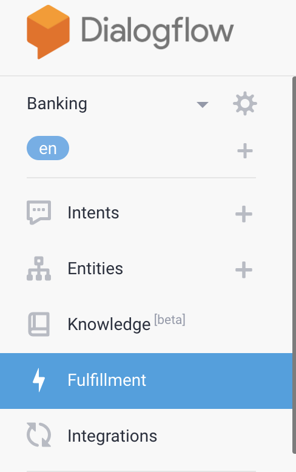

* Enable the inline editor functionality:

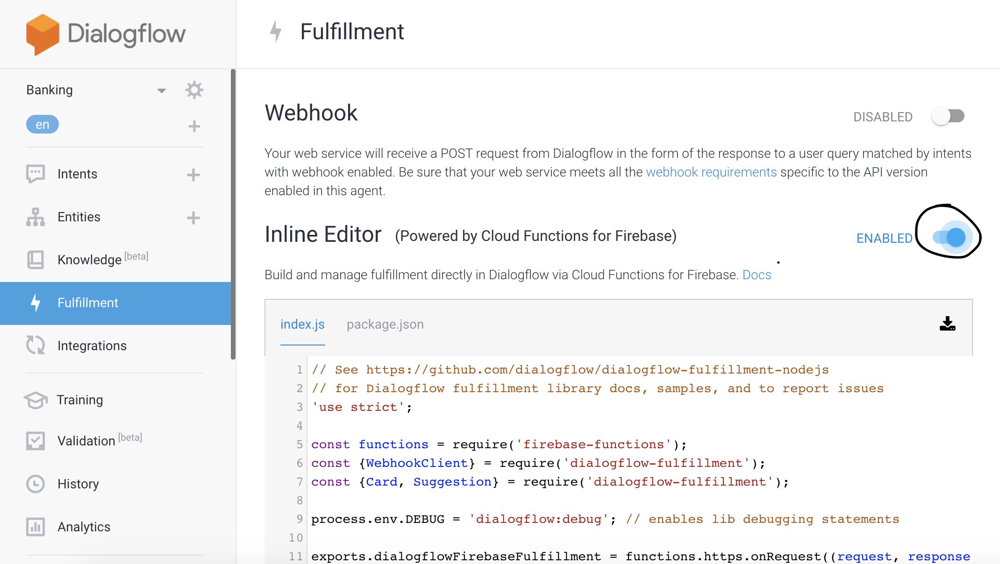

* Add CoCo SDK To Package JSON:

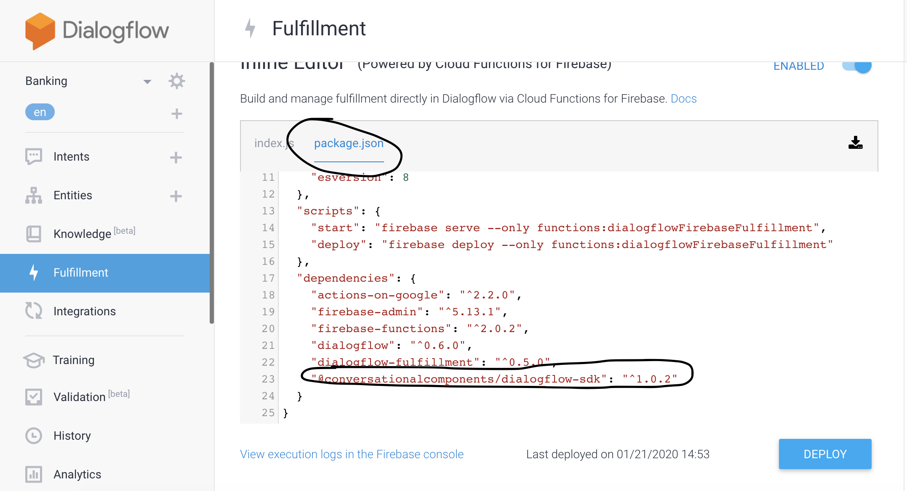

Copy the line(don't forget the comma in the end of line above):
```javascript
    "@conversationalcomponents/dialogflow-sdk": "^1.0.2"
```

* Import CoCo SDK functions:

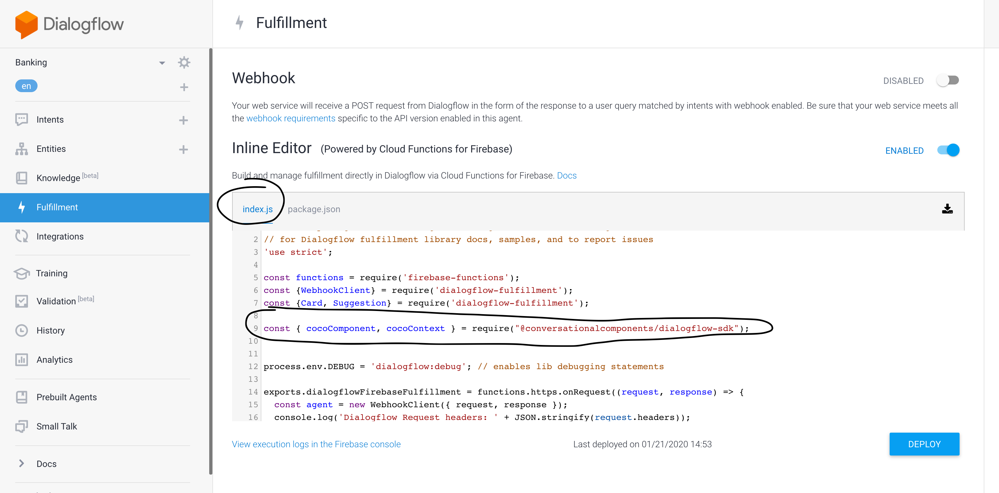

Copy the line:
```javascript
const { cocoComponent, cocoContext } = require("@conversationalcomponents/dialogflow-sdk");
```

### Create Intent For CoCo Context.
The intent is needed to maintain CoCo context through the conversation as long as
CoCo handles the multi-turn session with the end user.

* Access intent tab:

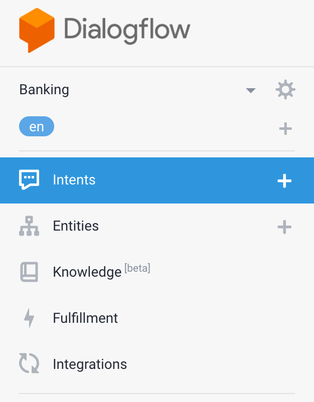

* Create CoCo context intent:

The intent must have an input context called `coco`, also it has to be configured with
the catch all functionality (It is illustrated in the `Training Phrases` section of the picture below).

1. Add any string as a training example
2. Double click on the training example string
3. Pick @sys.any from the list
4. Enable webhook call for the intent (scroll all the way down and click on the toggles)

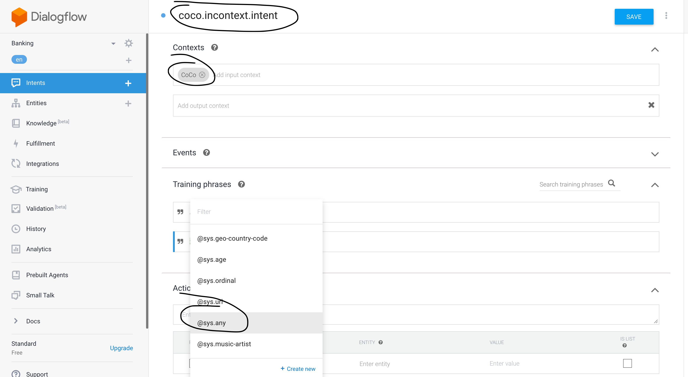
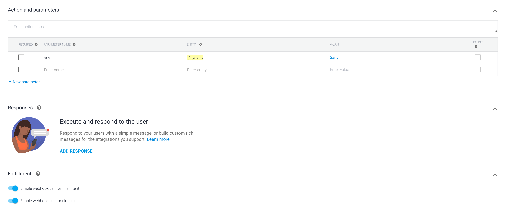


### Map CoCo Context Intent To cocoContext SDK SDK Function:
Map the CoCo context intent to the coco Context function from the CoCo SDK:

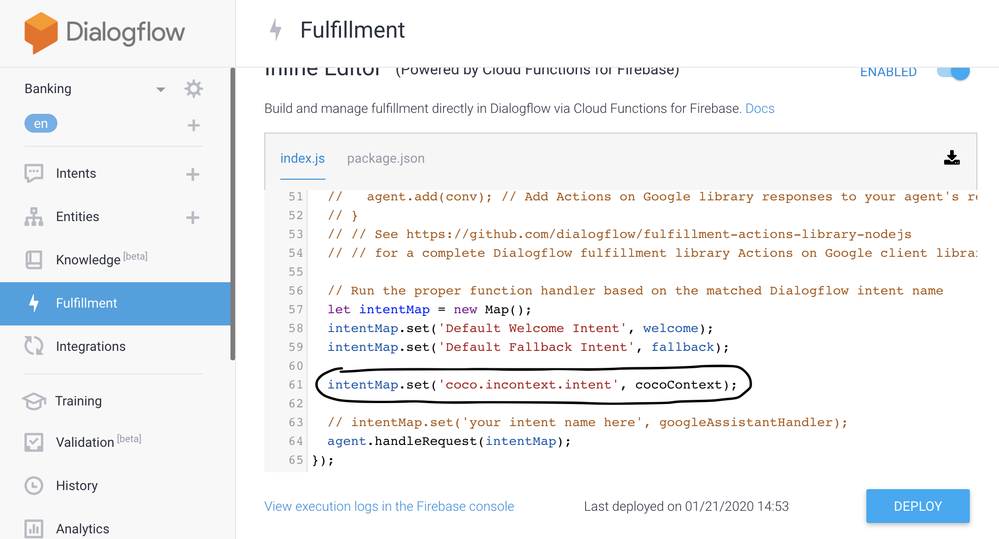
Copy the line:
```javascript
intentMap.set('coco.incontext.intent', cocoContext);
```

**Notice**: In order to be able to send external requests to APIs from the fulfilment function(in other words calling CoCo),
you need to activate your Google firebase account. It will ask you for billing info.
Google provides a substantial free quota for this service, so you won't actually be charged.

## Plug Component To Your Conversation Flow.
* Access [CoCo Marketplace](https://marketplace.conversationalcomponents.com/ "CoCo Marketplace") and choose the relevant component:

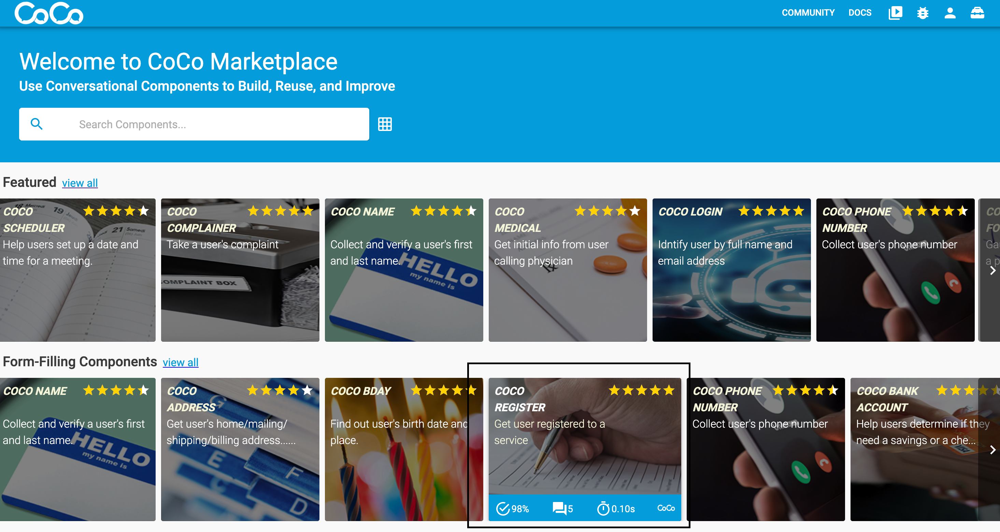

* Add the component to your CoCo workspace:

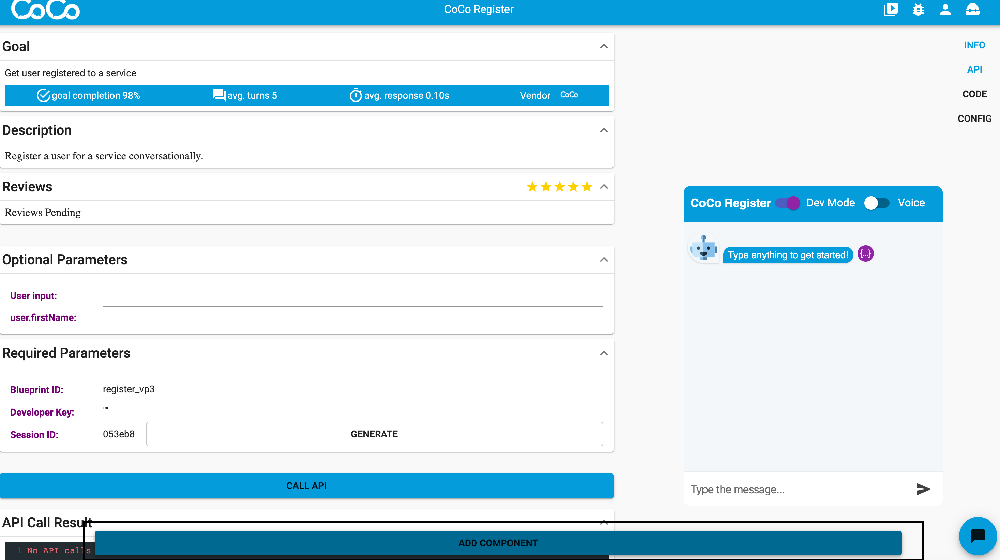

* Plug the component in to your conversation flow by mapping the relevant intent:
1. First create or use an exisiting intent.
2. Enable webhook call for the intent (scroll all the way down and click on the toggles)


3. Add mapping in the intentMap

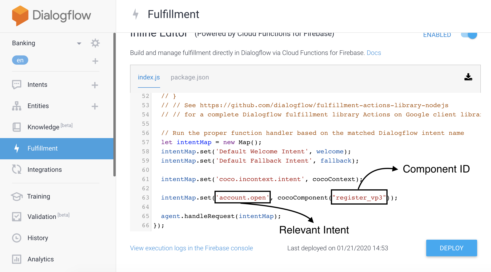

Copy the line:

```javascript
intentMap.set('account.open', cocoComponent("register_vp3"));
```

Click on DEPLOY

### Check Your Bot:
In the image blow, you can see that we received an answer from the component
when the correct intent triggered:

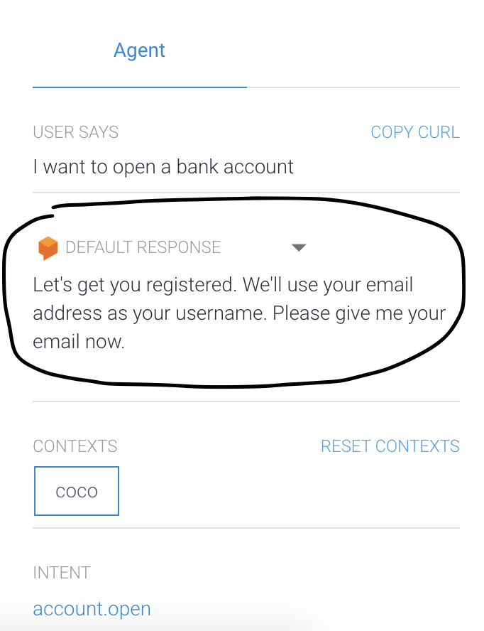

Also you'll notice a multi-turn conversation supplied by the component:

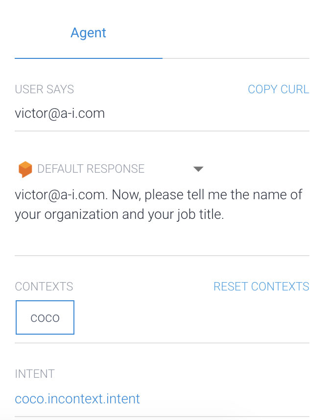

## Troubleshooting

* Getting the intent responses instead of the responses from the component:

log in to firebase dashboard -> functions -> delete dialogFulfillmentFunction -> click on the deploy button again in the fulfillment tab in Dialogflow.

*package.json and index.js might reset to the default code so repeat the steps from above*