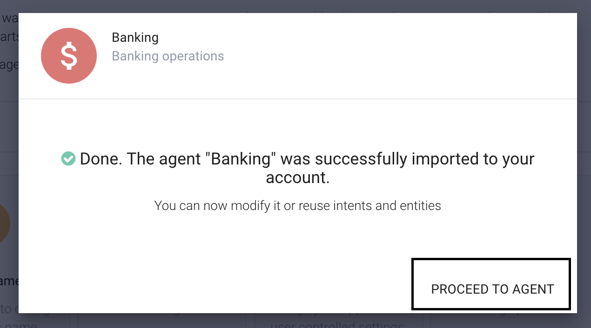
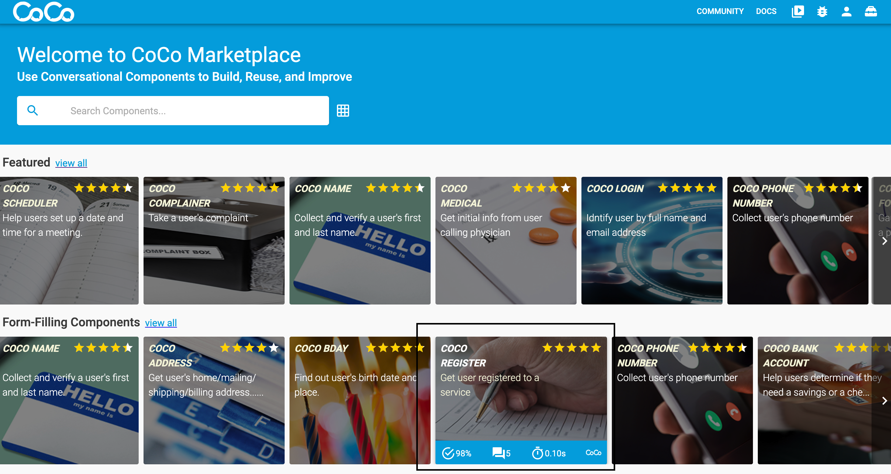

In the following tutorial we'll build a banking bot, using [Dialogflow](https://dialogflow.cloud.google.com/ "Dialogflow")
banking prebuilt agent and [CoCo](http://conversationalcomponents.com/ "CoCo") the 'Register' component from the [CoCo Marketplace](https://marketplace.conversationalcomponents.com/ "CoCo Marketplace").
I'll guide you thorough the whole process, including the implementation of the [CoCo](http://conversationalcomponents.com/ "CoCo") 'Register' component.


## Setup Prebuilt Bot On Dialogflow:
* Create a Dialogflow account.
* Go to the prebuilt agents menu:

* Choose banking agent:

* Import banking agent:




## Authentication With Dialogflow(Service Account Key):
* Extract agent service account key:
Go to agent settings.


Go to service accounts:


Generate JSON key:


* Place it in code sample directory as service_accout.json:


## Code Sample Overview:
We'll use a Flask application to expose our bot throut an API. For communication
with Dialogflow we'll use Dialogflow SDK and for communication with the CoCo component we'll use CoCo SDK.

**Code to code sample repository:**
[https://github.com/ConversationalComponents/webinar/tree/master/py](https://github.com/ConversationalComponents/webinar/tree/master/py "Sample Repo")

#### Flow:


#### Global Variable current_comp:
```python
MAIN_COMP = "default"

# Current component on which the session is running.
current_comp = MAIN_COMP
```
The current_comp global variable will be "default" when the
conversation is controlled by Dialogflow. When the control is passed to
a CoCo component the value of the current_comp variable will be the
CoCo component ID which is in control of the conversation right now.


#### CoCo And Dialogflow Access Functions:
Dialogflow and CoCo request wrapped with process functions.

Let's take a look at the process_dialogflow function:

```python
def process_dialogflow(session_id, text, language_code="en"):
"""
Returns bot output for user input.

Using the same `session_id` between requests allows continuation
of the conversation.

Arguments:
session_id (string): Current session ID.
text (string): User input.
language_code (string): Context language.
Returns:
Return tuple intent_name, bot_output (tuple).
"""

session = session_client.session_path(project_id, session_id)

text_input = dialogflow.types.TextInput(text=text,
language_code=language_code)

query_input = dialogflow.types.QueryInput(text=text_input)

response = session_client.detect_intent(session=session,
query_input=query_input)

return response.query_result.intent.display_name, response.query_result.fulfillment_text
```
The function receives the session_id and user input then returns intent display name
and response text.

And there is the process_coco function:

```python
def process_coco(component_id, session_id, input_text):
    """
    Process user input at a coco component.

    Arguments:
        component_id (string): Target component ID.
        session_id (string): Target session ID.
        input_text (string): User input text.

    Returns:
        CoCo component output. (string)
    """
    component = ConversationalComponent(component_id)

    return component(session_id=session_id, user_input=input_text)
```

The function receives CoCo component ID, session ID and user input.
The answer will be the component output.

#### /input Endpoint:
At the our `app.py` file we will implement /input endpoint, which will receive
`user_input` at the payload process the input and return bot response.(Will be
implemented at the "implement Component In Conversation Flow" topic.)


## Choose And Add Component:
* Access marketplace: [https://marketplace.conversationalcomponents.com/](https://marketplace.conversationalcomponents.com/ "CoCo Marketplace")
* Choose the 'Register' component:



* Add Component:


## Implement Component In Conversation Flow:

```python
@app.route("/input", methods=["POST"])
def get_input():
    global current_comp
    request_data = request.get_json() or {}
    user_input = request_data.get("user_input")
```

Send user input to Dialogflow.

```python
    # Get response from DialogFlow for user input.
    intent_name, bot_output = process_dialogflow(session_id=CURRENT_SESSION_ID,
                                                 text=user_input)
```

Choose a relevant intent which will trigger the control pass to a CoCo
component:


The relevant intent for registration is "account.open".

```python
    # If catch intent, give control to CoCo component.
    if intent_name == "account.open":
        current_comp = "register_vp3"

    if current_comp == "register_vp3":
        # Fetch response from CoCo if intent catch.
        coco_response = process_coco(component_id="register_vp3",
                                     session_id=CURRENT_SESSION_ID,
                                     input_text=user_input)

```

When component is done, pass the conversation control back to Dialogflow:

```python
        # If component done, return the control to the main flow.
        if coco_response.component_done:
            current_comp = MAIN_COMP

        bot_output = coco_response.response

    return jsonify({"response": bot_output}), 200, {}
```


## Run And Test The Bot:

pip install -r requirements.txt

flask run

try the bot at 127.0.0.1:5000


