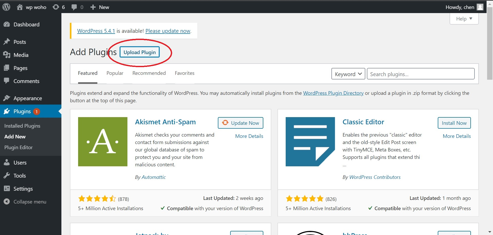
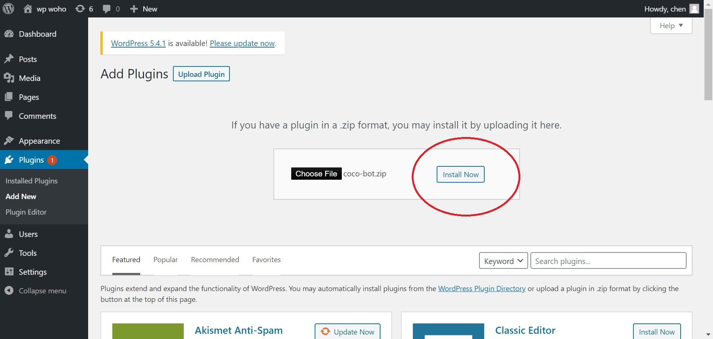
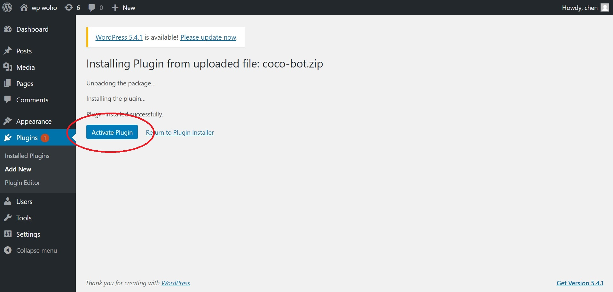

# Wordpress Cocohub Tutorial

In this tutorial we'll add a chat window to a conversational bot on Wordpress page, and use Cocohub visual editing tools to create our own bot from components. It's quick, easy, and lets you leverage powerful AI to engage your users.

### Before we begin: getting the plugin

We'll need a Wordpress site with admin access, and Cocobot Wordpress plugin. The plugin can be downloaded as coco-bot.zip file from here. The Worpress site with admin access is on you, though.

### Installing Cocobot plugin in Wordpress

We'll start by opening our Wordpress dashboard, and selecting PLUGINS from the drawer.

Click the ADD NEW button (marked in red oval).

Click the UPLOAD PLUGIN button (marked in red oval).

Click CHOOSE FILE, and select coco-bot.zip. Once that is done, click INSTALL NOW button (marked in red oval).

Now we just need to activate it. Click the ACTIVATE PLUGIN button (marked in red oval).

Great! The plugin is installed and activated.

We still need to add the shortcode to the pages we want our chat window to show at. Let's go to our main page, and edit any field.

Now to add the [cocobot] shortcode, and update the page.

All done! If you'll go to the page you just updated, you should see a chat window there. It's the interface to a cocobot, by default letting you talk to CoCo Bot, the Conversational Components evangelist.

You'll probably want to build your own bot, though, so let's get to that.

### Building a bot in Cocohob

Start by heading over to [www.cocohub.ai](Cocohob), and sign in.

Welcome!

When you're ready, choose Bots Studio from the drawer, and click ADD to create a new bot.

_Everything in Coco bots is made of components. The component for making a bot is called a Glue component - it glues other components together_

Now we have the most basic glue possible - just a single node (_that's what we call components when they're in glue_). By default it points to namer - a component for getting a user's name.

That's not much of a bot, yet.
Click anywhere on the background for ADD NODE button to appear. Click on it to add a new node. We should now have something that looks a like this:

Still not much of a bot. We have an entry node (_the one on the left, with the golden star to the right of the component name_), and another one. You might want to change the component the second node uses - they always default to namer. In the example below it's been changed to register_vp3, a component for getting the user's email.

Also, they're as yet unlinked, so drag from the entry node's DRAG TO LINK button to the second node.

Now we have a bot, looking a bit like this:

This bot will get the user's name, and when it's finished getting the name it'll also get the user's email address. Now we can save the changes (_SAVE button in the control panel_), and chat to our newly created bot in the chat window. Note that if SAVE button is enabled, you still have unsaved changes.

Nicely done!

Time to use our new bot in Cocobot Wordpress plugin. Click the COPY GLUE ID button on the control panel:

With the newly created Glue ID copied to our clipboard, let's head back to Wordpress admin dashboard, and configure our plugin to use the Glued bot.

### Configuring Cocobot Wordpress plugin

Head over to Plugins, and click SETTINGS on CocoHub plugin.

Now we just to have to pase the ID of the Glue component we created into **component-id or url** field (marked in red oval), and click SAVE CHANGES.

All done! Head back to the page you inserted [cocobot] shortcode to, and chat with your Glued bot from the comfort of your Wordpress site.

Or change the other settings first:

**Name** is the name that's appear in the header of your bot's chat window

**Bot Greeting** is what the bot will say to user when the window fist loads

**Height** and **Width** define the dimentions of your bot's chat window

**Is Fabless** is a checkbox for whether the chat window has a close/open button or not. When it's on, the chat window cannot be closed.

**Chat-window is open by default** is a checkbox for whether the chat window starts opened. Only relevant if **Is Fabless** is off.
