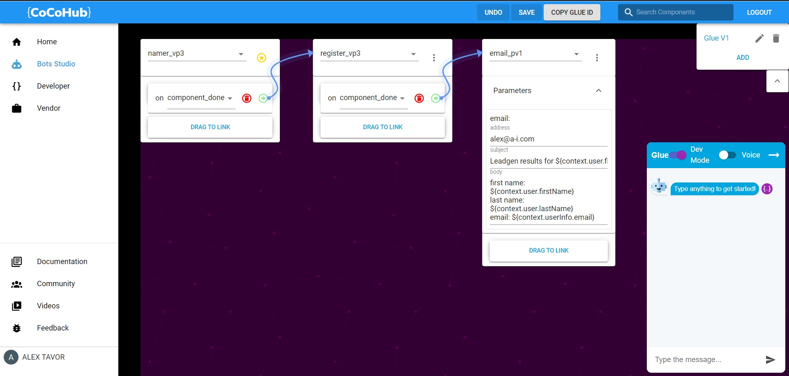
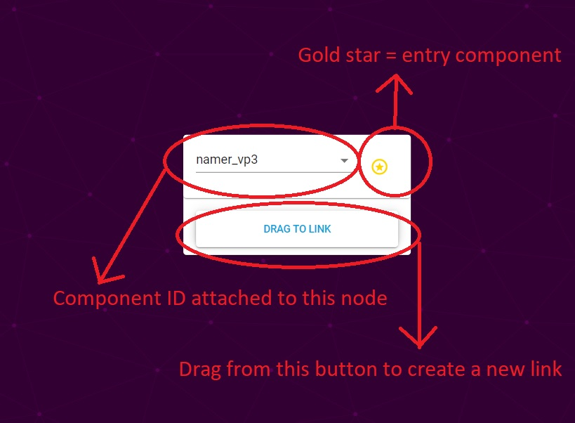
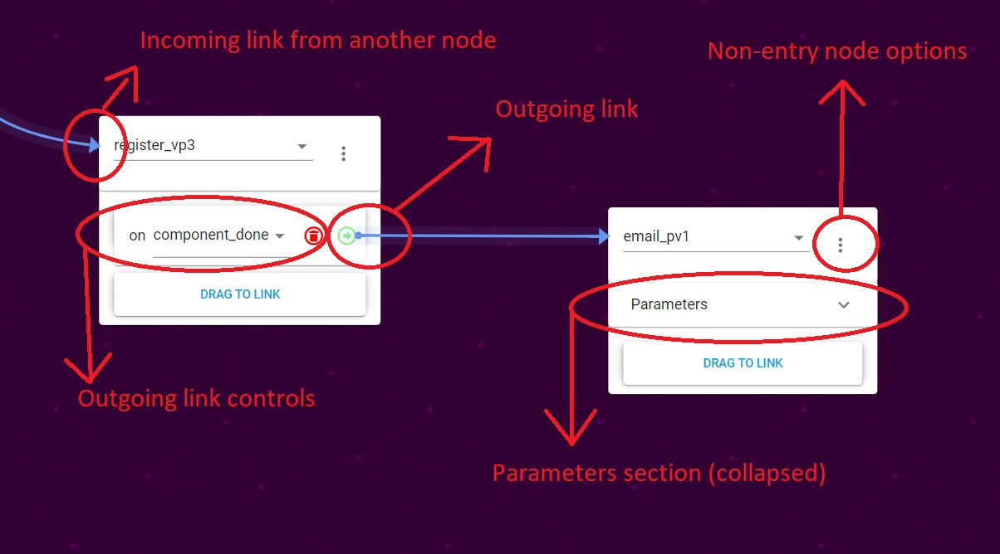

# Wordpress Cocohub Tutorial

In this tutorial we'll guide you through adding a chat window to a conversational bot on a Wordpress page as well as using Cocohub visual editing tools to create your own bot from components. It's quick, easy, and lets you leverage powerful AI to engage your users.

# Table of Contents

2. [Installing Cocohub plugin in Wordpress](#installInWP)
3. [Building a bot in Cocohub](#buildingInGlue)
4. [Configuring Cocohub plugin](#configurePlugin)

### Installing Cocohub plugin in Wordpress 

We'll start by opening our Wordpress dashboard, and selecting PLUGINS from the drawer.

Click the ADD NEW button (marked in red oval).

Search for cocohub in keywords, and click the INSTALL NOW button on the card (marked in red oval).

Now we need to activate the plugin. Click the ACTIVATE button on the card.

Great! The plugin is installed and activated.

We still need to add the shortcode to the pages on which we would like our chat window to show. Let's go to a page in our Wordpress site and edit any field.

Now add the [cocobot] shortcode and update the page.

All done! If you navigate to the page you've just updated, you should see a chat window there. It's the interface to a Cocobot, the Conversational Components evangelist bot.

You'll probably want to build your own bot, though, so let's get to that.

### Building a bot in Cocohub 

Start by heading over to [Cocohub](www.cocohub.ai), and signing in or registering, if you're a first time user.

Welcome!

When you're ready, choose Bots Studio from the drawer, and click ADD to create a new bot.

Now we should have something that looks like this:

Glue works with Nodes and Links - nodes are containers for components, and links route conversation flow between components. 

Let's take a deeper look at the leftmost node:

The gold star in the rightmost corner indicates that it's an Entry component. This is the first component the bot's user will converse with. There must always be an entry component in each Glue.

The text field containing namer_vp3 is the components associated with this node. The default component is namer_vp3, but you can use any component from Cocohub here. Click on it to enter search mode.

DRAG TO LINK button creates a link between nodes. We'll discuss this in greater detail below.

This is what a couple of linked nodes look like. 

Incoming link from another node means that another node has an action on which conversation flow will route to this component.

Outgoing link is a route from a node to a different one. This is what's created using the DRAG TO LINK button.

Outgoing link controls allow you to change the outgoing link. 
The text field containing "component done" allows you to select the action on which routing to a different node will happen. The default action is "component done" - that is, when the component has achieved it's goal. 
You can also delete the link here.

Non-entry node options is a menu of controls for a non-entry node - it allows you to set a node as entry or to delete it.

Parameters is a collapsible field for components that have parameters associated with them. "email_pv1" component has them, and when expanded the parameters look like this:

If an email is associated with your account, it'll be in the address field. This is the email address to which the results will be sent once the bot is finished.

!!!note "Warning"
    If there is no email in the address field, you won't get the email!

Last, but not least, the general Glue controls:

Save and Undo buttons are only enabled if you can save or undo. Saving generates a new Glue ID, and resets the chat window. 

COPY GLUE ID button - copies the last saved Glue ID to your clipboard.

Chat window is where you can talk to the latest saved version of your bot. Please note that if SAVE button is turned on, you have unsaved changes which will not be reflected in the chat.
 
This bot will get the user's name, and when it's finished getting the name it'll also get the user's email address. Once all that is done, it'll send you an email with the user's details. Now we can save the changes (_SAVE button in the control panel_), and chat to our newly created bot in the chat window. 

!!!note "Pro Tip"
    Everything in Coco bots is made of components. The component for making a bot is called a Glue component - it glues other components together. Since a glue is also a component, you can use glue components as nodes in a glue! 

Nicely done!

Time to use our new bot in the Cocohub Wordpress plugin. Let's save any changes we have, and click the COPY GLUE ID button. Now let's head back to Wordpress admin dashboard, and configure our plugin to use the Glued bot.

### Configuring Cocohub Wordpress plugin 

Head over to Plugins, and click SETTINGS on CocoHub plugin.

Now we just to have to pass the ID of the Glue component we created into **component-id or url** field (marked in red oval), and click SAVE CHANGES.

All done! Head back to the page to which you inserted [cocobot] shortcode, and chat with your Glued bot from the comfort of your Wordpress site.

Or change the other settings first:

**Name** is the name that'll appear in the header of your bot's chat window

**Bot Greeting** is what the bot will say to user when the chat window fist loads

**Height** and **Width** define the dimensions of your bot's chat window

**Is Fabless** is a checkbox for whether the chat window has a close/open button or not. When it's on, the chat window cannot be closed.

**Chat-window is open by default** is a checkbox for whether the chat window starts opened. Only relevant if **Is Fabless** is off.

That concludes the tutotial. Hopefully it'll put you on the path to making awesome, useful, engaging and fantastic bots!
