# Wordpress CoCoHub Tutorial

In this tutorial we'll guide you through adding a chat window to a conversational bot on a Wordpress page as well as using CoCoHub visual editing tools to create your own bot from components. It's quick, easy, and lets you leverage powerful AI to engage your users.

## Installing CoCoHub plugin in Wordpress

We'll start by opening our Wordpress dashboard, and selecting PLUGINS from the drawer.

Click the ADD NEW button (marked in red oval).

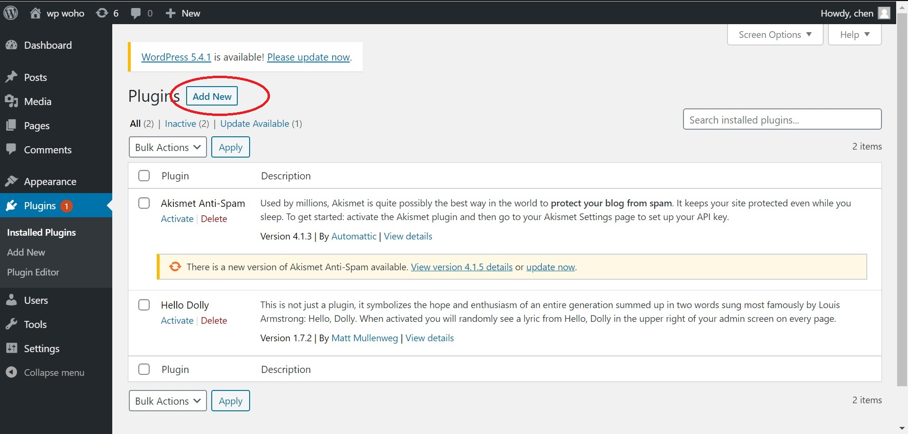

Search for CoCoHub in keywords, and click the INSTALL NOW button on the card (marked in red oval).

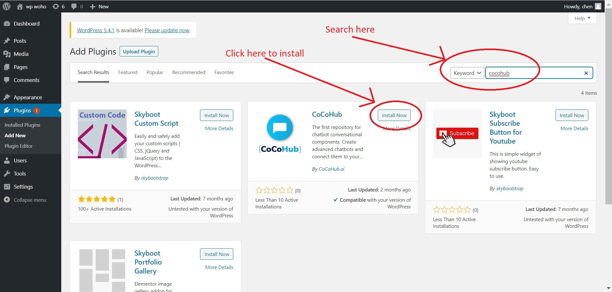

Now we need to activate the plugin. Click the ACTIVATE button on the card.

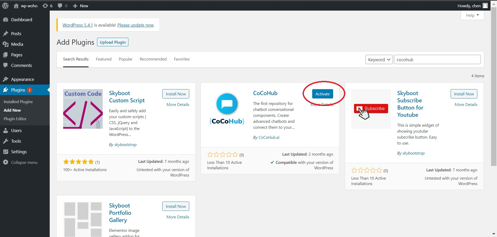

Great! The plugin is installed and activated.

We still need to add the shortcode to the pages on which we would like our chat window to show. Let's go to a page in our Wordpress site and edit any field.

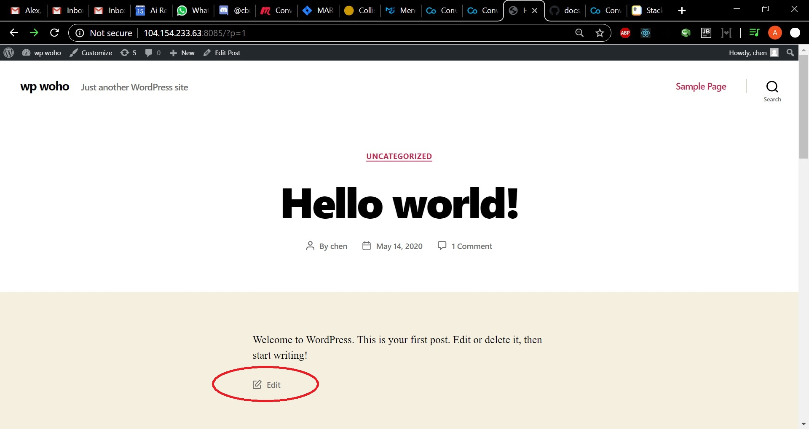

Now add the [cocobot] shortcode and update the page.

All done! If you navigate to the page you've just updated, you should see a chat window there. It's the interface to a Cocobot, the Conversational Components evangelist bot.

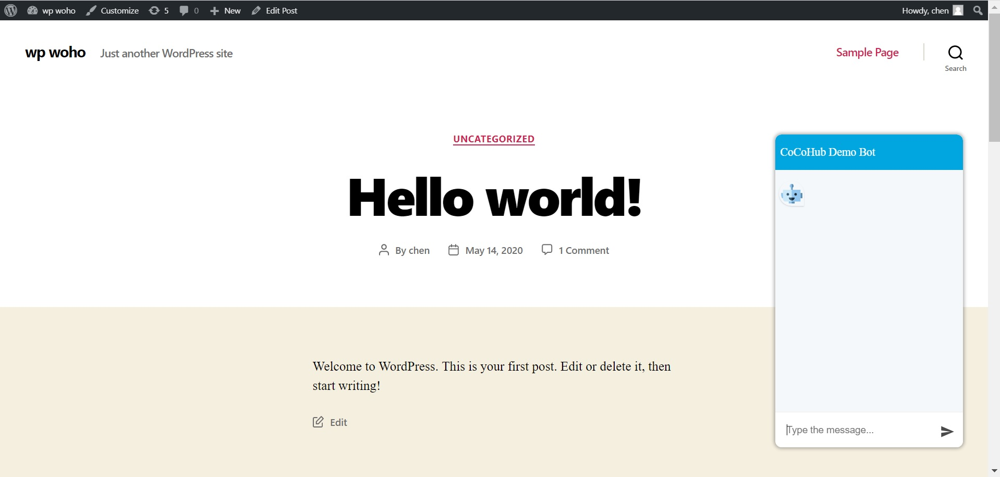

You'll probably want to build your own bot, though, so let's get to that.

## Building a bot in CoCoHub

Start by heading over to [CoCoHub](www.cocohub.ai), and signing in or registering, if you're a first time user.

Welcome!

When you're ready, choose Bots Studio from the drawer, and click ADD to create a new bot.

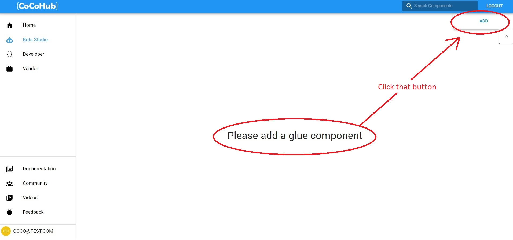

Now we have the most basic glue possible - just a single node (_that's what we call components when they're in glue_). By default it points to a component called namer - a component for getting and verifying a user's name.

!!!note "Pro Tip"
    Everything in Coco bots is made of components. The component for making a bot is called a Glue component - it glues other components together. Since a glue is also a component, you can use glue components as nodes in a glue! 

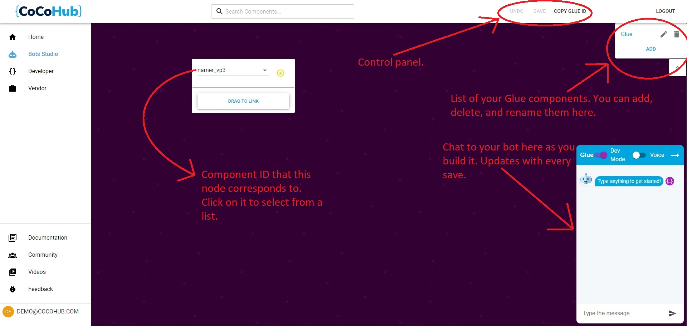

That's not much of a bot, yet :)

Click anywhere on the background for an ADD NODE button to appear. Click on it to add a new node. We should now have something that looks like this:

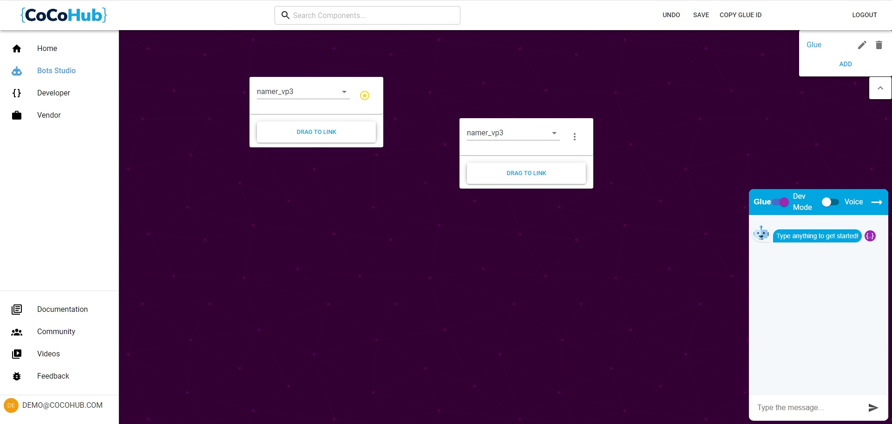

Still not much of a bot :/ We have an entry node (_the one on the left, with the golden star to the right of the component name_), and another one. You might want to change the component the second node uses - they always default to namer. In the example below it's been changed to register_vp3, a component that asks the user for their email address.

Also, they're as yet unlinked, so use the DRAG TO LINK button to connect the first node to the second node.

Now we have a bot that loooks a bit like this:

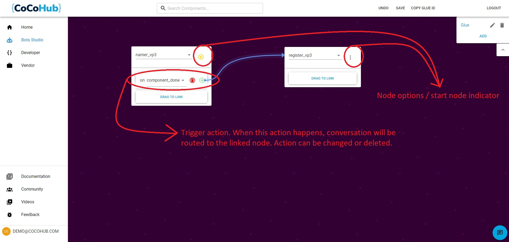

This bot will get the user's name, and when it's finished getting the name it'll also get the user's email address. Now we can save the changes (_SAVE button in the control panel_), and chat to our newly created bot in the chat window. Note that if SAVE button is enabled, you still have unsaved changes.

Nicely done!

Time to use our new bot in the CoCoHub Wordpress plugin. Click the COPY GLUE ID button on the control panel:

With the newly created Glue ID copied to our clipboard, let's head back to Wordpress admin dashboard, and configure our plugin to use the Glued bot.

## Configuring CoCoHub Wordpress plugin

Head over to Plugins, and click SETTINGS on CoCoHub plugin.

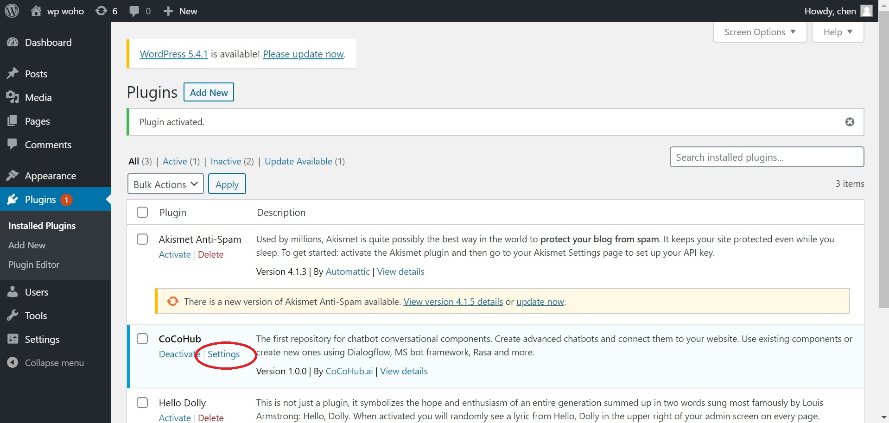

Now we just to have to pass the ID of the Glue component we created into **component-id or url** field (marked in red oval), and click SAVE CHANGES.

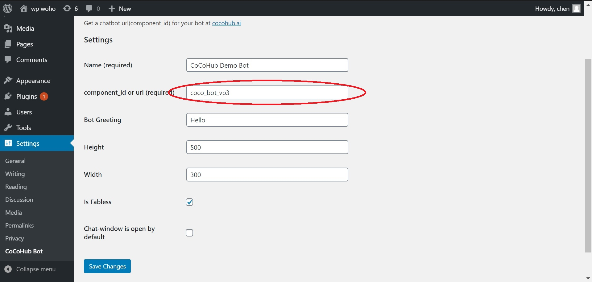

All done! Head back to the page to which you inserted [cocobot] shortcode, and chat with your Glued bot from the comfort of your Wordpress site.

Or change the other settings first:

**Name** is the name that'll appear in the header of your bot's chat window

**Bot Greeting** is what the bot will say to user when the chat window fist loads

**Height** and **Width** define the dimensions of your bot's chat window

**Is Fabless** is a checkbox for whether the chat window has a close/open button or not. When it's on, the chat window cannot be closed.

**Chat-window is open by default** is a checkbox for whether the chat window starts opened. Only relevant if **Is Fabless** is off.

That concludes the tutotial. Hopefully it'll put you on the path to making awesome, useful, engaging and fantastic bots!
